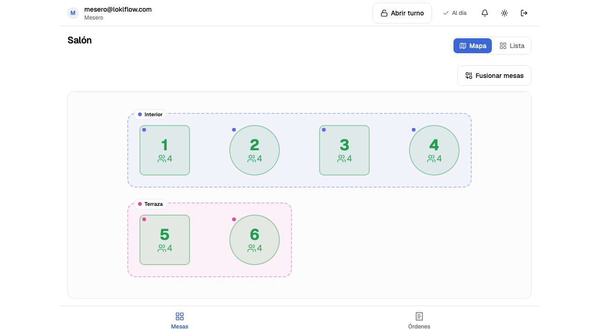
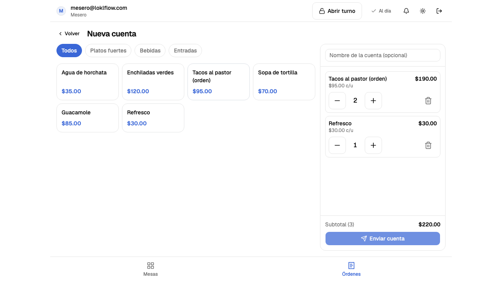
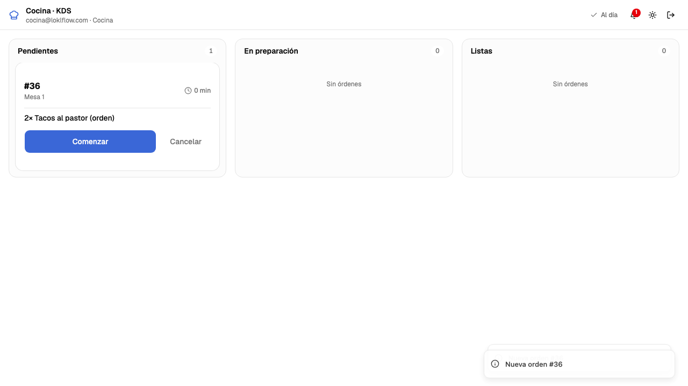
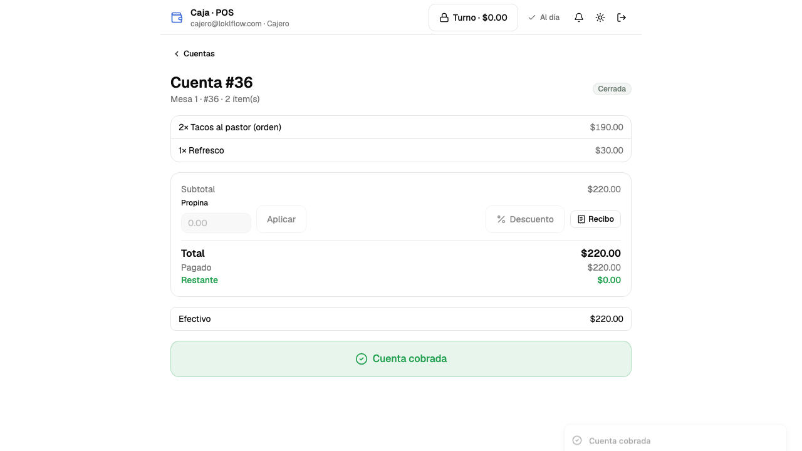

<div align="center">

# LoklFlow

**Sistema Integral de Gestión para Establecimientos F&B**

*Restaurantes · Bares · Cafeterías*


</div>

---

## ¿Qué es LoklFlow?

LoklFlow es una plataforma web de gestión operativa para establecimientos de alimentos y bebidas, **idempotente por diseño**. Centraliza en un solo sistema todo lo que necesita un negocio para operar: órdenes, menú, inventario, caja, roles de personal y reportes.

Que la operación no se detenga cuando se cae la red **ya no depende de dónde esté el servidor: depende del dispositivo**. Cada tablet guarda el cascarón de la aplicación en un Service Worker y una copia del salón en IndexedDB, encola lo que no pudo enviar y lo reenvía sola cuando vuelve el camino. El servidor acepta esos reenvíos sin duplicar nada —el uuid lo acuña el dispositivo y es la clave primaria de la comanda, los pagos llevan `clientRequestId`, `order_number` sale de una secuencia de Postgres—, así que reintentar es seguro por construcción y no por suerte.

Lo que mueve dinero —cobrar, abrir o cerrar turno, aprobar un descuento— **exige red a propósito**, y cuando no la hay la pantalla enseña el motivo en lugar de un «Error». El porqué de cada caso está escrito en [`docs/OFFLINE.md`](./docs/OFFLINE.md).

---

## Stack Tecnológico

| Capa | Tecnología |
|------|-----------|
| **Monorepo** | Turborepo · pnpm workspaces |
| **Backend** | NestJS 11 · TypeScript · TypeORM · PostgreSQL 16 · Socket.io |
| **Frontend** | Next.js 16 (App Router) · React 19 · Tailwind CSS 4 · Dexie (IndexedDB) · Service Worker escrito a mano |
| **Infra** | Docker Compose en desarrollo · una imagen por app, construidas desde la raíz del monorepo |
| **Calidad** | ESLint 10 (flat config) · TypeScript strict · Jest (unitarias + integración) · Vitest · Playwright (e2e, a11y y móvil) |
| **CI** | GitHub Actions · tres jobs, incluidas las dos imágenes de Docker arrancadas de verdad |

> Redis está declarado (`ioredis`, `config/redis.config.ts`) y levantado por el `docker-compose` de
> desarrollo, pero **nadie conecta a él**: es la pieza que hará falta el día que haya más de una
> instancia de la API —el adaptador de Socket.io y el almacén del throttler—. Hoy ni el CI ni un
> despliegue lo necesitan, y decirlo aquí evita que alguien lo dé por usado.

---

## Arquitectura

```
       POS (caja)     Mesero (móvil)     Cocina (KDS)     Cliente (QR)
            │                │                 │                │
            └────────────────┴────────┬────────┴────────────────┘
                                      │
                                      │  un solo origen — HTTP y WebSocket
                                      ▼
                      ┌──────────────────────────────────────┐
                      │  Proxy inverso                       │
                      │    /api  ·  /socket.io   →  NestJS   │
                      │    todo lo demás         →  Next.js  │
                      └───────────────┬──────────────────────┘
                                      │
                ┌─────────────────────┴─────────────────────┐
                │                                           │
        ┌───────▼────────────────┐              ┌───────────▼────────────┐
        │  Next.js               │              │  NestJS                │
        │  cascarón de las       │─────────────▶│  API REST + Socket.io  │──▶  PostgreSQL
        │  vistas, con la sesión │   la cookie  │  guards por permiso    │
        └────────────────────────┘              └────────────────────────┘
```

Es **una** aplicación: una base de datos, dos procesos y un solo origen. El menú por QR no es un
servicio aparte, sino la superficie pública de la misma API (`src/public/`), con DTOs propios para
no filtrar lo que las entidades llevan dentro.

El origen único no es una preferencia de infraestructura, es un requisito del código: la cookie de
sesión se emite `sameSite: 'strict'` y **sin atributo `domain`**, y quien la lee es el servidor de
Next —el middleware de `proxy.ts` y `server-client.ts`—. Con la API en otro subdominio esa cookie
sería host-only del suyo, el middleware no la vería nunca y toda ruta protegida rebotaría a
`/login`. Hay además un salto que el diagrama no dibuja: para pintar el HTML, el servidor de Next
llama a la API con la cookie de esa misma petición; el navegador, en paralelo, habla directo con
`/api` para todo lo que muta.

Dónde vive el conjunto es una decisión de despliegue y no de código: son las mismas dos imágenes
de Docker sobre un VPS o sobre una máquina dentro del propio local, y lo único que cambia es quién
resuelve el dominio. Hoy corre sobre Dokploy tras Traefik ([Despliegue](#despliegue)).

**Sin red, las tres superficies operativas siguen en pie.** `/waiter`, `/kitchen` y `/pos` son
cascarón de servidor más vista de cliente sobre la copia local, así que renderizan sin servidor y
lo que el operario toca se encola con su clave de idempotencia ya acuñada. El resto del panel
—altas, edición, reportes, métricas— no: pide datos al servidor y lo dice con palabras cuando no
puede, distinguiendo «la API no contesta» de «la API contestó mal», que llevan a acciones
distintas.

Lo que **no** existe, y conviene decirlo aquí y no en la letra chica: no hay capa de sincronización
con una nube, ni tablero remoto aparte, ni respaldo automático, ni multi-sucursal. El respaldo es
el de la base de datos y es responsabilidad del entorno donde esté desplegada.

---

## Roles del Sistema

| Rol | Descripción |
|-----|-------------|
| **Super Admin** | Dueño. Acceso total. Configura roles, menú, mesas y empleados. |
| **Gerente** | Gestiona turnos, aprueba descuentos, ve reportes. |
| **Cajero** | Opera el POS, procesa pagos, cierra turno. |
| **Mesero** | Toma órdenes desde móvil, gestiona sus mesas. |
| **Cocina** | Ve la cola de órdenes en tiempo real en el KDS. |
| **Cliente** | Accede al menú vía QR y ordena desde su teléfono. |

> Los roles son completamente configurables. El Super Admin puede crear roles personalizados con permisos granulares por módulo.

---

## Roadmap de Desarrollo

El proyecto se construye en 6 fases (Fundación → Columna Vertebral → Core → Caja → Offline → Inventario → Pulido). Cada fase tiene un entregable funcional independiente.

Detalle completo en [docs/ROADMAP.md](./docs/ROADMAP.md).

---

## Estado Actual

```
Fase 0 ████████████████████ 100%  — Completada
Fase 1 ████████████████████ 100%  — Completada (auth, RBAC, CI y despliegue)
Fase 2 ████████████████████ 100%  — Completada (incluida la fusión de mesas)
Fase 3 ████████████████████ 100%  — Completada
Fase 4 ████████████████████ 100%  — Completada (offline y sincronización)
Fase 5 ████████████████████ 100%  — Completada (inventario y menú QR)
Fase 6 ████████████████████ 100%  — Completada (seguridad, cobertura, e2e y pulido)
```

Diferidos a conciencia, no olvidados: envío del recibo por correo y exportación a PDF/Excel
(Fase 3). El resto del alcance está entregado, y lo que entra ahora es trabajo de producto sobre
esa base.

### El sistema en marcha

| | |
|---|---|
|  |  |
| **Salón** — mesas por sector con su estado en color | **Comanda** — se toca el producto, el total sube solo |
|  |  |
| **Cocina** — la comanda aparece **sin recargar**, en otra pantalla | **Caja** — cobro, split y propina; al saldarse libera la mesa |

> Las capturas las produce la propia suite de e2e (`E2E_CAPTURAS=1`), recorriendo el flujo real
> contra la API y la base. Se regeneran cuando cambia la interfaz en vez de pudrirse — el guion
> del recorrido está en [`docs/DEMO.md`](./docs/DEMO.md).

### Módulos implementados

| Módulo | Descripción |
|--------|-------------|
| **Auth + RBAC** | Login email/PIN, JWT + refresh, roles y permisos granulares, panel admin, auditoría. Cambiar un rol o desactivar a alguien invalida sus sesiones vivas por versión de token |
| **Menú** | Categorías, productos, modificadores, combos y disponibilidad por horario |
| **Mesas y Sectores** | Sectores, mesas (número único global, estados), reservas y **editor visual de distribución** (drag-and-drop, zonas, formas, creación masiva) |
| **Órdenes** | Órdenes con ítems y modificadores, cálculo de totales, flujo de estados con historial de transiciones |
| **Tiempo real** | WebSockets (Socket.io) con handshake autenticado por cookie; órdenes y estado de mesas se actualizan en vivo en el panel sin recargar |
| **Vista de mesero** | App móvil (`/waiter`, login por PIN): salón con mesas por sector, tomar orden con modificadores, avanzar estados y cambiar estado de mesa, todo en vivo |
| **KDS de cocina** | Pantalla dedicada (`/kitchen`, login por PIN): tablero por columnas (pendientes/en preparación/listas) con tiempo transcurrido, avance por orden en vivo |
| **Notificaciones** | Avisos persistidos entre roles (campana con no leídas + bandeja): cocina recibe órdenes nuevas, el mesero recibe "orden lista"; push por WebSocket y persistencia en BD |
| **Caja / POS** | Cobro de cuentas (`/pos` del cajero y desde la cuenta del mesero): múltiples métodos, split en pagos parciales, propina; cierra la cuenta y libera la mesa automáticamente |
| **Venta de mostrador** | `/admin/venta`: despachar y cobrar en el mismo gesto, sin mesa ni comanda. El catálogo llega con sus existencias en una sola petición y toda la venta viaja en una sola llamada; exige turno abierto, igual que cualquier otro cobro |
| **Turnos de caja** | Apertura/cierre de turno por cobrador con fondo inicial; cada pago se sella al turno y el cobro exige turno abierto; al cerrar, arqueo automático (ventas por método, efectivo esperado vs. contado y diferencia) |
| **Descuentos** | Umbral por rol: si el descuento cabe en el límite se aplica al instante, si lo excede queda pendiente y le llega un aviso al gerente, que lo resuelve en `/admin/approvals`. Motivo obligatorio y todo el flujo auditado. Se rechaza si dejaría el total por debajo de lo ya cobrado |
| **Recibo** | Vista de 80 mm en `/recibo/[id]` con los datos fiscales del negocio, desglose del IVA contenido en el precio y los pagos registrados; impresión directa del navegador, sin librerías |
| **Panel de métricas** | `/admin` con ventas cobradas, ticket promedio, cuentas abiertas, tiempo medio de preparación, top de productos y reparto por método de pago; se actualiza en vivo al cerrar una cuenta |
| **Reportes** | Exportación de ventas a CSV por rango de fechas (con BOM y CRLF para Excel) |
| **Auditoría** | Las acciones críticas con actor, IP y valor anterior; consulta paginada y filtrable en `/admin/audit`. Las credenciales se redactan antes de persistir |
| **Idempotencia** | El uuid que genera el dispositivo es la clave primaria de la orden y de sus ítems, y los pagos aceptan `clientRequestId`. Reenviar una operación devuelve el estado en lugar de duplicar la cuenta o el cobro. `order_number` sale de una secuencia de Postgres |
| **Inventario** | Ingredientes con unidad y mínimo, proveedores, recetas por producto y movimientos de stock (entrada, merma, ajuste). El cierre de cuenta descuenta el consumo de forma idempotente, así que un cobro reenviado no resta dos veces |
| **Existencias por producto** | Stock del producto terminado —lo que se vende en barra— sin montar un segundo motor de stock. La mercancía **entra por cajas** («6 cajas × 24») y una entrada **suma** sobre la fila bloqueada en vez de fijar el total: una venta que se cierre en ese mismo instante no se pierde |
| **Catálogo por CSV** | Importación con previsualización y plantilla descargable, y exportación en ese mismo formato. El lector de CSV está escrito a mano, así que el navegador no carga una librería para leer un archivo de texto |
| **Búsqueda y filtrado** | Todos los listados del panel aceptan `?q=`, más los filtros propios de cada uno (categoría, sector, estado…). La comparación vive en un solo sitio (`common/search.ts`) y **ignora acentos y mayúsculas** con la extensión `unaccent`. Los filtros viven **en la URL**: una vista filtrada es un enlace que se guarda y se manda |
| **Modo sin conexión** | Cola de operaciones en IndexedDB con orden por cuenta, reintentos con espera creciente y cerrojo entre pestañas; las tres superficies operativas leen del dispositivo y siguen funcionando con la API caída. Cobrar y abrir turno siguen exigiendo red **a propósito**. Documentado en [`docs/OFFLINE.md`](./docs/OFFLINE.md) |
| **Menú QR** | Código por mesa con rotación e impresión en hoja; el cliente abre `/m/[código]`, ve el menú filtrado por disponibilidad horaria y pide desde su teléfono sin instalar nada ni tener cuenta. Seguimiento del pedido con un token de invitado que caduca |
| **Fusión de cuentas** | Juntar varias cuentas en una antes de cobrar, con deshacer exacto. Las cuentas fusionadas quedan fuera de los listados y de los reportes, que si no contarían las ventas dos veces |
| **Observabilidad** | Un JSON por línea, id de petición que viaja en la cabecera y en el cuerpo del error, `/api/health` que no toca la base y `/api/ready` que sí. El CI lo comprueba sobre la imagen en marcha |
| **CI/CD** | Tres jobs en GitHub Actions: lint, tipos, pruebas unitarias, build y dos suites de e2e en un navegador de verdad · integración contra un Postgres real, con las migraciones aplicadas desde cero y umbral de cobertura · construcción de las dos imágenes de Docker, que se arrancan para comprobar salud, cabeceras, formato del log y estáticos |

> **API documentada** con Swagger en `/api/docs`. Solo fuera de producción.

---

## Documentación

| Documento | Descripción | Estado |
|-----------|-------------|--------|
| [Visión del Proyecto (RUP)](./docs/LoklFlow_Vision_v1.0_1.docx) | Alcance, usuarios, requerimientos y riesgos | ✅ Completo |
| [Roadmap de Desarrollo](./docs/ROADMAP.md) | Fases, tareas y entregables del proyecto | ✅ Completo |
| [Modelo de Base de Datos](./docs/DATA_MODEL.md) | Tablas, relaciones y decisiones de diseño | ✅ Completo |
| [Sistema de Diseño](./docs/design-system.md) | Tokens, tipografía, densidad táctil y patrones de pantalla | ✅ Completo |
| [Sincronización sin conexión](./docs/OFFLINE.md) | Qué se difiere, la vida de una operación, conflictos y límites conocidos | ✅ Completo |
| [Seguridad](./docs/SECURITY.md) | Auditoría OWASP Top 10 con los riesgos residuales aceptados | ✅ Completo |
| [Demo](./docs/DEMO.md) | Guion del recorrido, minutado y cómo regenerar las capturas | ✅ Completo |

> El esquema lo construyen las migraciones de `apps/api/src/database/migrations/`, y el CI lo
> levanta desde cero en cada ejecución. La cuenta exacta de tablas no se cita aquí a propósito:
> derivó tres veces y la fuente de verdad es la carpeta.

---

## Estructura del Proyecto

```
loklflow/
├── .github/workflows/ci.yml    # verify · integration · images
├── apps/
│   ├── api/                    # Backend NestJS
│   │   ├── Dockerfile          # contexto de build: la raíz del monorepo
│   │   ├── test/               # arnés de integración (arranque, sesiones, fixtures)
│   │   └── src/
│   │       ├── auth/           # JWT + refresh, login por email y por PIN
│   │       ├── users/
│   │       ├── roles/          # RBAC granular por módulo:acción
│   │       ├── token-version/  # invalida sesiones vivas al cambiar un rol
│   │       ├── business-config/
│   │       ├── audit/
│   │       ├── menu/           # categorías, productos, combos, import/export CSV
│   │       ├── tables/         # sectores, mesas, reservas, QR
│   │       ├── orders/         # comandas y fusión de cuentas
│   │       ├── payments/       # cobro, split, propina
│   │       ├── shifts/         # turnos de caja y arqueo
│   │       ├── notifications/
│   │       ├── discounts/      # umbral por rol y aprobaciones
│   │       ├── inventory/      # ingredientes, proveedores, recetas y existencias
│   │       ├── reports/        # agregados y exportación a CSV
│   │       ├── public/         # menú QR: la única superficie anónima
│   │       ├── realtime/       # gateway de Socket.io
│   │       ├── common/         # guards, filtros, pipes, búsqueda (search.ts) y CSV
│   │       ├── config/         # entorno: base de datos, JWT, redis
│   │       └── database/       # migraciones y seeds
│   └── web/                    # Frontend Next.js
│       ├── Dockerfile          # salida standalone
│       ├── e2e/                # Playwright: núcleo sin conexión, servicio, a11y y móvil
│       ├── public/             # Service Worker, manifiesto e iconos
│       └── src/
│           ├── proxy.ts        # middleware: rutas protegidas y públicas
│           ├── app/
│           │   ├── (auth)/     # login y login por PIN
│           │   ├── (dashboard)/admin/   # panel: menú, mesas, inventario, venta, roles…
│           │   ├── (print)/    # recibo de 80 mm, sin barra ni cabecera
│           │   ├── (public)/m/ # menú QR, sin sesión
│           │   ├── pos/        # vista del cajero
│           │   ├── waiter/     # vista del mesero (móvil)
│           │   ├── kitchen/    # KDS de cocina
│           │   └── offline/    # respaldo que sirve el Service Worker
│           ├── components/     # incluye ui/ (shadcn) y admin/filters/
│           ├── hooks/
│           ├── stores/
│           └── lib/
│               ├── offline/    # cola, copia local y superposición de pendientes
│               ├── api/        # cliente del navegador y del servidor de Next
│               ├── csv/        # lector y escritor propios
│               ├── url.ts      # los filtros del panel viven en la URL
│               └── observability/
├── packages/
│   ├── types/                  # tipos TypeScript compartidos
│   └── config/                 # ESLint flat config y TSConfig base
├── docs/                       # documentación técnica
├── turbo.json
├── docker-compose.yml          # solo postgres y redis; las apps corren en local
├── .dockerignore
├── .env.example
└── README.md
```

---

## Cómo Correr el Proyecto

```bash
# Clonar el repositorio
git clone https://github.com/tu-usuario/loklflow.git
cd loklflow

# Copiar variables de entorno
cp .env.example .env

# Generar los secretos JWT — la API se niega a arrancar con los valores de ejemplo
openssl rand -base64 48    # → JWT_SECRET
openssl rand -base64 48    # → JWT_REFRESH_SECRET

# Levantar PostgreSQL y Redis (las apps corren en local)
docker compose up -d

# Instalar dependencias (pnpm gestiona el monorepo con Turborepo)
pnpm install

# Crear el esquema y cargar los datos iniciales
pnpm --filter=api migration:run
pnpm --filter=api seed

# Correr todos los servicios en desarrollo
pnpm dev

# Correr solo un app específico
pnpm dev --filter=api
pnpm dev --filter=web
```

En desarrollo el esquema se sincroniza solo (`synchronize: true` cuando
`NODE_ENV=development`). Fuera de desarrollo se aplica **solo** con migraciones — nunca con
`synchronize`.

> Correr `migration:run` **también en desarrollo** no es opcional aunque `synchronize` ya haya
> creado las tablas: `synchronize` construye el esquema pero no ejecuta migraciones, y la
> extensión `unaccent` llega en una de ellas. Sin ella toda búsqueda del panel revienta con
> `function unaccent(text) does not exist`.

### Calidad

```bash
pnpm lint         # ESLint 10 en las 3 workspaces
pnpm typecheck    # tsc --noEmit
pnpm test         # unitarias: funciones puras del backend, tipos y componentes del web

# Integración: la app real contra un Postgres real. Usa la base loklflow_test, nunca la de
# desarrollo, y aplica las migraciones desde cero — así se comprueba que el esquema se puede
# levantar de la nada en cada ejecución.
docker compose up -d postgres
pnpm --filter=api test:int

# Lo mismo, más las unitarias, con cobertura y umbral. Es lo que corre el CI.
pnpm --filter=api test:cov:all

# e2e en un navegador de verdad, contra el build de producción. Son dos suites:
pnpm --filter=web build && pnpm --filter=web test:e2e            # núcleo sin conexión
pnpm --filter=web build:e2e && pnpm --filter=web test:e2e:servicio  # con la API y la base vivas
```

> Las dos suites de e2e necesitan builds distintos: `NEXT_PUBLIC_API_URL` se hornea en el
> bundle, así que un mismo build no puede a la vez hablar con una API viva y no tener ninguna
> al otro lado. `build:e2e` fija la variable y el puerto a la vez.

Los mismos pasos, más las imágenes de Docker, corren en GitHub Actions en cada push y cada PR
(`.github/workflows/ci.yml`).

### Rendimiento

La mitad **determinista** está automatizada y corre en cada PR: `jsx-a11y` en el lint y
`@axe-core/playwright` sobre cinco pantallas, exigiendo cero violaciones `serious` o `critical`.

Lighthouse **no** es un paso de CI, a propósito: sobre un servidor standalone en un runner
compartido tiene una varianza de ±10 puntos y crea un gate intermitente que la gente aprende a
relanzar en vez de a arreglar. Se mide a mano, contra el build de producción:

```bash
pnpm --filter=web build
node apps/web/.next/standalone/apps/web/server.js &   # necesita el cp de .next/static y public/
pnpm dlx lighthouse http://localhost:3000/login --preset=desktop --view
```

Lo que sí se puede afirmar sin varianza es el peso del bundle, que sale del propio build. Las
optimizaciones que hizo la Fase 6 fueron tres, y las tres tienen un motivo concreto:

- `recharts` —la dependencia más pesada— sale del arranque de `/admin` con `next/dynamic`. Era
  carga síncrona en la primera pantalla que ve el dueño, para dos gráficas que están por debajo
  del pliegue.
- `/pos` pedía el turno de caja **dos veces** en cada carga: el layout y la página. Ahora
  comparten un helper envuelto en `cache()` de React.
- Diez `loading.tsx` cubren las rutas que hacen entre dos y seis peticiones antes de pintar. No
  las pantallas de alta y edición: un esqueleto para cuarenta milisegundos es un parpadeo.

---

## Despliegue

Vive en **Dokploy**, con un solo origen tras Traefik: `/api` y `/socket.io` van al backend y todo
lo demás al web. Esa topología no es un detalle de infraestructura, cambia dos decisiones del
código y las dos están comentadas donde importan:

- El **Service Worker filtra por path**, no por origen. `url.origin !== self.location.origin`
  funciona en desarrollo (:3000 contra :3001) y **en producción no filtra nada**, porque la API es
  el mismo origen. La regla que sostiene «no cachear respuestas autenticadas» es saltar `/api` y
  `/socket.io`.
- El **`connect-src` del CSP** se deriva de `NEXT_PUBLIC_API_URL`, incluida su forma `wss://`.
  En producción bastaría `'self'`; en desarrollo hace falta nombrar el puerto.

### El orden importa

1. **Las migraciones primero, y a mano.** No se aplican al arrancar: dos instancias levantando a
   la vez se pelearían por el mismo `ALTER TABLE`. Es un paso explícito
   (`migration:run:prod && seed:deploy`).
2. **La API antes que el web.** Varios cambios son contratos de servidor —la hora del hecho de la
   cola sin conexión, la versión de sesión—, y un web nuevo contra una API vieja manda toda la
   cola a la bandeja de fallos.
3. **`seed:deploy`, nunca `seed:prod`.** El segundo crea cuatro usuarios de demostración con
   credenciales publicadas en un repositorio público.
4. **`NEXT_PUBLIC_API_URL` se hornea en el build.** Cambiar de host obliga a reconstruir la imagen
   del web, no a cambiar una variable de entorno.

Ninguna migración del proyecto es destructiva: todas son columnas nuevas con valor por defecto o
nulables, así que la API vieja sigue funcionando contra el esquema nuevo. Eso es justamente lo que
permite migrar **antes** de desplegar.

`JWT_SECRET` y `JWT_REFRESH_SECRET` no tienen valores por defecto: la API se niega a arrancar si
faltan o si conservan el `change-this-*` del ejemplo.

---

## Licencia

MIT © 2026 — LoklFlow
